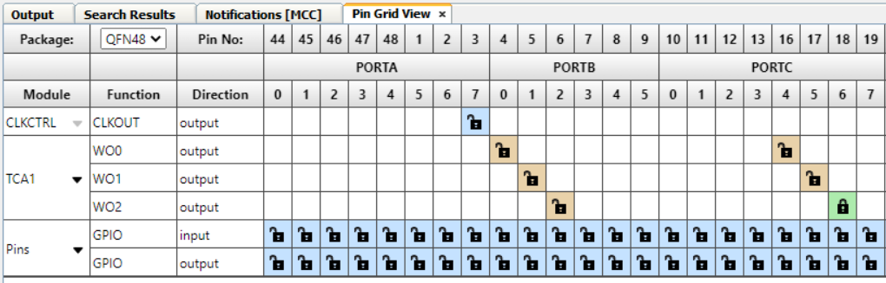

# AVR128DA48 LED Blink using PWM Code Example

This repository provides a MPLAB X project with a MCC generated code example for an LED blink driven by a PWM signal. The example demonstrates how to generate a PWM signal using a timer. The output waveform is connected to the on-board LED. The PWM duty cycle value is set at 50%. For half of the period the LED is turned ON, and for the other half the LED is turned OFF.

## Related Documentation

More details and code examples on the AVR128DA48 can be found at the following links:

- [AVR128DA48 Product Page](https://www.microchip.com/wwwproducts/en/AVR128DA28)
- [AVR128DA48 Code Examples on GitHub](https://github.com/microchip-pic-avr-examples?q=avr128da48)
- [AVR128DA48 Project Examples in START](https://start.atmel.com/#examples/AVR128DA48CuriosityNano)

## Software Used

- [MPLAB® X IDE](http://www.microchip.com/mplab/mplab-x-ide) v6.10 or newer
- [MPLAB® XC8](http://www.microchip.com/mplab/compilers) 2.41 or newer
- [AVR-Dx Device Family Pack](https://packs.download.microchip.com/) v2.3.272 or newer

## Hardware Used

- [AVR128DA48 Curiosity Nano](https://www.microchip.com/Developmenttools/ProductDetails/DM164151) Development Board is used as test platform:
 

## Operation

To program the Curiosity Nano board with this MPLAB® X project, follow the steps provided in the [How to Program the Curiosity Nano Board](#how-to-program-the-curiosity-nano-board) chapter.  

## Setup

The following configurations must be made for this project:

- Clock Control:
  - Clock Selection: Internal high-frequency oscillator
  - Internal Oscillator Frequency: 1-32 MHz internal oscillator
  - Oscillator Frequency Selection: 4 MHz system clock
  - Prescaler Enable: Yes
  - Prescaler Division: 16X
   

- Configuration Bits:
  - Watchdog Timeout Period: Watch-Dog timer off
   

- Interrupt Manager:
  - Global Interrupt Enable: No
   

- TCA1:
  - Enable Timer: Yes
  - Clock Selection: System Clock
  - Requested Timeout: 262 ms
  - Waveform Generation Mode: Single Slope PWM
  - Enable Channel 2: Yes
  - Duty Cycle 2: 50%
   
   
  

|     Pin      |    Configuration   |
| :----------: | :----------------: |
|  PC6 (LED0)  |    Digital Output  |

 

## Demo

 

## Summary

The demo shows how to generate a PWM signal using Timer/Counter Type A (TCA). The output of the TCA is connected to the on-board LED of the AVR128DA48 Curiosity Nano board and a waveform signal is generated.

##  How to Program the Curiosity Nano board

This chapter shows how to use the MPLAB X IDE to program an AVR® device with an `Example_Project.X`. This can be applied for any other projects. 

1. Connect the board to the PC.

2. Open the `Example_Project.X` project in MPLAB X IDE.

3. Set the `Example_Project.X` project as main project:
   Right click on the project in the **Projects** tab and click Set as Main Project.
   

4. Clean and build the `Example_Project.X` project:
   Right click on the `Example_Project.X` project and select Clean and Build.
   

5. Select AVRxxxxx Curiosity Nano in the Connected Hardware Tool section of the project settings:
   Right click on the project and click Properties.
   Click on the arrow under the Connected Hardware Tool.
   Select the AVRxxxxx Curiosity Nano (click on the SN). 
   Click Apply and then OK.
   

6. Program the project to the board:
   Right click on the project and then Make and Program Device.
   

 

- [Back to Setup](#setup)
- [Back to Demo](#demo)
- [Back to Summary](#summary) 
- [Back to Top](#avr128da48-led-blink-using-pwm-code-example)